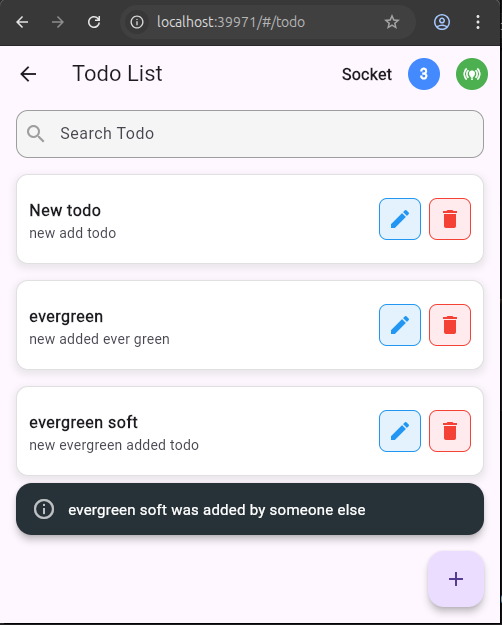
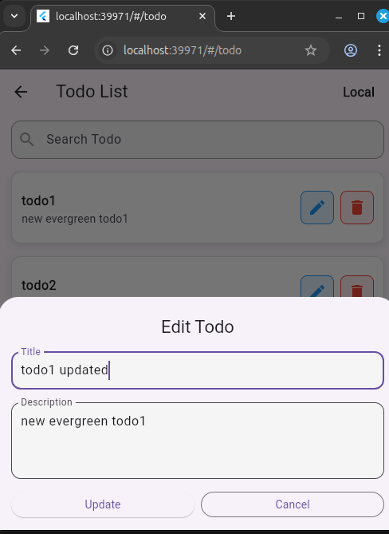

## 📸 Screenshots

### ✅ Todo Added with Broadcast Notification  
Shows a broadcast notification when a new todo is added.  


### 🔁 Filter Todos  
Demonstrates filtering the todo list based on criteria.  


### ➕ Add New Todo  
Interface for adding a new todo item using the socket source.  


### ✏️ Update Todo  
Shows updating an existing todo and broadcasting the changes.  



### ✅ Prerequisites

- Node.js (v16 or later)
- Flutter SDK (3.10 or later recommended)

---

## 🔧 Setup & Run

### ▶️ Backend (Node.js Server)

1. Navigate to the backend folder:

```bash
cd backend