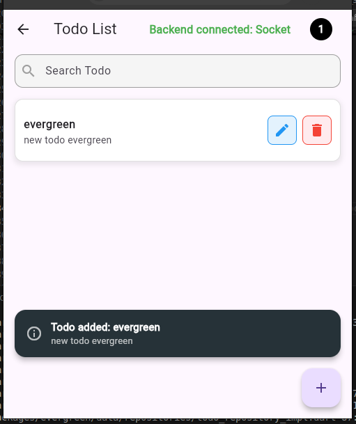
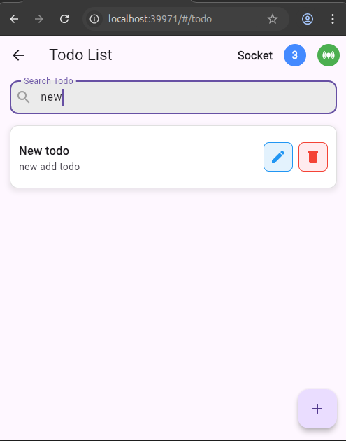
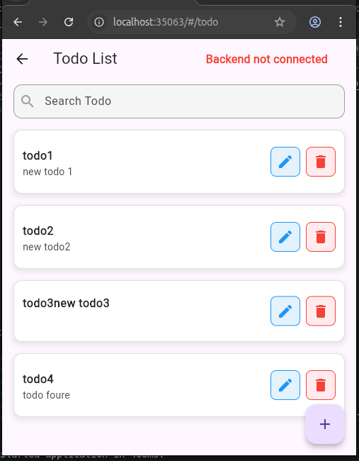

## 📸 Screenshots

### ✅ Todo Added with Broadcast Notification  
Shows a broadcast notification when a new todo is added.  


### 🔁 Filter Todos  
Demonstrates filtering the todo list based on criteria.  


### ➕ Add New Todo  
Interface for adding a new todo item using the socket source.  


### ✏️ Update Todo  
Shows updating an existing todo and broadcasting the changes.  


---

## 🚀 Getting Started

### ✅ Prerequisites

- [Flutter](https://flutter.dev/) (3.x or higher recommended)
- [VS Code](https://code.visualstudio.com/) or Android Studio
- [Node.js](https://nodejs.org/)

---

## 🛠 Installation

### 1. Clone the Repository

```bash
git clone https://github.com/yared098/flutter-socketio-todo-app-.git
cd frontend
```

### 2. Install Dependencies

```bash
flutter pub get
```

### 3. Run the App

```bash
flutter run
```

---

## 🔌 Backend Server Setup

The backend is built using **Node.js** and **Socket.IO**.

### Steps:

```bash
cd backend
npm install
npm run dev
```

Make sure to update the port and the socketurl in `lib/config/config.dart` if necessary:

``` dart 
class AppConfig {
  static const String socketHost = '127.0.0.1';  // if not work , try 'localhost'
  static const int socketPort = 3000;  // change to your socket server port
  static String get socketUrl => 'http://$socketHost:$socketPort';
}

```

Replace `PORT` with the actual port number your backend is running on.

---

## 📱 Mobile App Instructions (Frontend)

The application supports two data sources:

- **Local**: Stores data locally on the device.
- **Socket**: Connects to a backend server via Socket.IO for real-time updates.

### 🧩 Switching Data Sources

- If the backend server is running successfully, the app will automatically switch to the **Socket** data source and connect to the backend.
- If the server is not available, the app will default to using the **Local** data source.

---

### 📝 Notes

- Ensure the backend server is running; otherwise, all CRUD operations will be handled locally on the device.

---

## 📬 Contact

- **GitHub**: [yared098](https://github.com/yared098)  
- **Phone**: +251988107722  
- **Email**: fdessalew@gmail.com  
- **Website**: [https://desst-46d7c-5e781.web.app/](https://desst-46d7c-5e781.web.app/)
